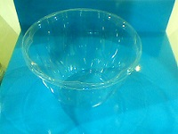

/ Data Ingestion and Image Processing

Using Azure ML Computer Vision Package, this hands-on lab demonstrates how you can ingest image datasets and perform image processing using third party libraries for advanced Computer Vision tasks. 

In many scenarios such as in manufacturing plants/medical imaging, images are typically available incrementally over time. To have a vision system that can make incremental changes to refine the performance can be very valuable. Azure ML Computer Vision Package offers flexibility to process images incrementally. The lab also integrates OpenCV to show how you can extract edges from a sample set of images for more advanced shape detection. Edge detection is used as an example to demonstrate integration of OpenCV's image processing functionalities.

### Learning Objectives ###

The objectives of this lab are to:
- Understand the image classification workflow
- Learn how to format a dataset in order to ingest into the workflow
- Learn how to add images incrementally to the workflow
- Use third party libraries such as OpenCV to extract images

### Data

In this lab, we will use a sample classification dataset (resources/sample_data.zip) related to recyling dishes. The dataset consists of four classes: bowls, plates, cups and cutlery as shown below: 

| Bowl |Plate|Cup|Cutlery| 
|------|------|------|-----|
||||

The sample dataset indicates the format required to ingest in the pipeline. You will find that there should be a top level folder containing folders for each class:
````
imgs_recycling\bowl\...
imgs_recycling\cup\...
imgs_recycling\cutlery\...
imgs_recycling\plate\...
````

#### Dataset creation from directory

The below python code will create a dataset from a directory with folders representing different classes. The _print_info_ function provides detailed distribution of the dataset as shown below.

````python
dataset = ClassificationDataset.create_from_dir(dataset_name, dataset_location, enable_logging=enable_logging)

dataset.print_info()
`````

```
Dataset name: recycling
Total classes: 4 ,total images: 63
Label-wise image count:
         bowl : 5 images
         cup : 19 images
         cutlery : 7 images
         plate : 32 images
Sample images for each class:
         bowl :
                 C:\AppData\Temp\2\azureml_runs\cvp_project_1523844450768\classification\sample_data\imgs_recycling\bowl\msft-plastic-bowl20170725152138800.jpg
                 C:AppData\Temp\2\azureml_runs\cvp_project_1523844450768\classification\sample_data\imgs_recycling\bowl\msft-plastic-bowl20170725152141939.jpg
                 C:AppData\Temp\2\azureml_runs\cvp_project_1523844450768\classification\sample_data\imgs_recycling\bowl\msft-plastic-bowl20170725152154282.jpg
```

#### Dataset creation from json

Dataset can also be created using a json file that maps labels to files in a directory. For example, the below json maps each of the labels (cup, plate and bowls) to directories containing the corresponding files:

````json
{
    "cup": ["C:\\path2data\\sample_data\\imgs_recycling\\cup\\"],
    "plate": ["C:\\path2data\\sample_data\\imgs_recycling\\plate\\"],
    "bowl": ["C:\\path2data\\sample_data\\imgs_recycling\\bowl\\"]
}
````

The function _create_dataset_from_json_ generates a dataset using the json_file _file_labels_ as shown below:

````python
    def create_dataset_from_json():

        file_labels = "C:\\path2json\\file_labels.json"

        dataset = ClassificationDataset.create_from_json("recycling", file_labels, context=None)
        dataset.print_info()
````

### Incrementally adding Images

The AML Package for Computer Vision provides `ClassificationDataset.add_image(image, labels=None)` for adding images incrementally from file system to an existing dataset.

Refer to the below function that adds an image to an existing dataset:

````python
    def add_image_dataset(dataset, path_image, label_image):
        labels_dict = {}
        for item in dataset.labels:
            labels_dict[item.name] = item
        dataset.add_image(Image(storage_path=path_image, name=path_image.split('\\')[-1]), labels_dict[label_image])
````

### Edge Detection

Edge detection includes a variety of mathematical techniques that aim at identifying points in a digital image at which the image brightness changes sharply. Edge detection is often used for further segmentation or more precise measurements of elements in the picture and has many applications in Aerial Imaging, Medical Imaging, etc. 

In this lab, we wil use the well-known Canny edge detection algorithm that comes with OpenCV to extract useful structural information from different vision objects. It is a multi-stage algorithm that reduces noise first and then finds intensity gradient of the image.

The function `extract_contour` calls _GuassianBlur_ that blurs an image using a Guassian filter first and then applies _Canny_ filter to extract edges. The color channels are swapped as OpenCV expects BGR while CVTK expects images in the RGB format.

````python
def extract_contour(train_set_orig):
    """
      Applies Canny edge detection
      Args:
        train_set_orig : The original set of images from 
        the training set
    """
    images = train_set_orig.images
    for item in images:
        # Change axis
        color_img = np.array(np.transpose(item.as_np_array(), (1,2,0)))
        # Transform to grayscale and apply mean filter
        gray_img = cv2.GaussianBlur(cv2.cvtColor(color_img, cv2.COLOR_BGR2GRAY), (0,0), 1)
        # Apply Canny edge detector on the image
        contour_img = cv2.Canny(np.uint8(gray_img), 30, 120)
        contour_filename = item.storage_path.split('.')[0] + '_contour.jpg'
        cv2.imwrite(contour_filename, contour_img)
````

An example of the edges extracted from an image with a cup is shown below:


### Execution

Launch Azure Machine Learning Workbench and open CLI by selecting File -> Open Command Prompt.

The script containing various data creation functions and edge extraction is _extract_contours.py_. Run th below command to execute the script:

```az ml experiment submit -c local extract_contours.py```

### Exercise

1. Create a dataset from a json file and investigate the output of _print_info_ to confirm the successful creation of the dataset.

2. Can you add a random image to the dataset created from the above step using _add_image_dataset_ and verify that the dataset is updated?
